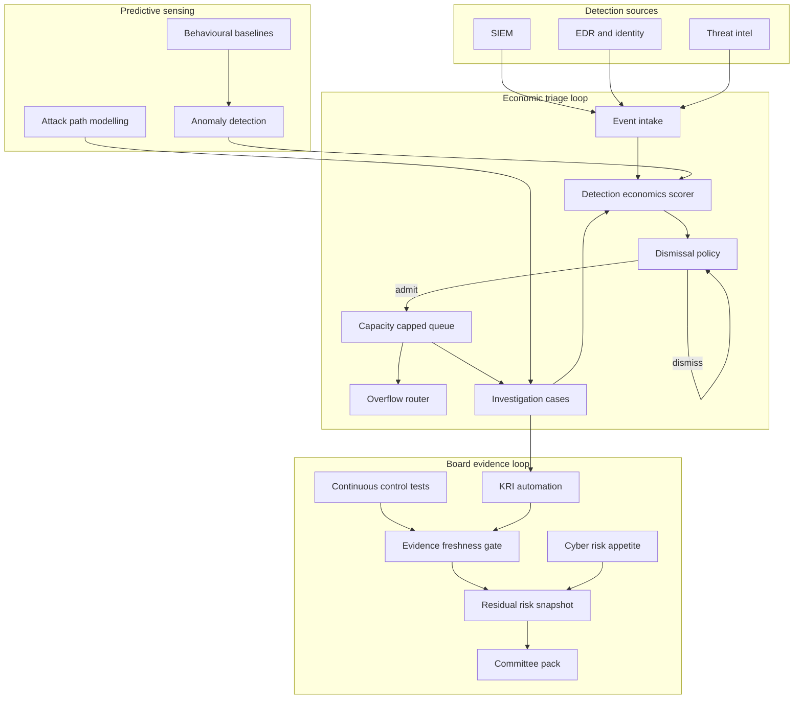

# Alertworth

**Source:** `ai-in-cyber/deloitte-ca-en-smart-cyber-pov-aoda/`
**Domain:** `ai-cyber`
**One-liner:** A detection-economics operating system for Canadian enterprise SOCs that scores every alert by expected loss if ignored versus analyst minutes to investigate, fills the triage queue to capacity rather than to volume, and only lets board KRIs rise as high as the underlying detection evidence is fresh.
**Wedge:** Mid-to-large Canadian enterprises — federally regulated financial institutions, energy and utilities, telecoms, and public-sector operators — whose SOC already has a SIEM and an MDR contract but whose board pack still reports alert volume and open tickets rather than residual cyber risk against appetite. The entry point is first-level triage: the source names alert cleansing and prioritisation as the place machine learning can automate volume work so scarce analysts stop drowning in signature noise.
**Positioning:** An adaptive defence operating model, not another detection sensor. Endpoint, network, and identity tools generate events; SIEM and SOAR orchestrate playbooks; GRC tools hold policies and attestations. None of them answers the economic question the source frames as the perfect storm — exponentially growing events, short talent, and board-level decisions that still look backwards at losses already booked. Alertworth sits above detection tooling as the queue, the cost ledger, and the board evidence layer for smart cyber: predictive risk intelligence that converts reactive loss capture into near-real-time KRIs with thresholds the organisation actually owns.

## Market research synthesis

### Thesis from source

The Canadian Cyber Risk Services point of view argues that artificial intelligence technologies are starting to have the same kind of industrial impact on cyber defence that factories had on manufacturing: improving efficiency and enabling operating models that were not previously practical. In cyber specifically, AI can improve threat intelligence, prediction, and protection; enable faster attack detection and response; and reduce dependence on human cybersecurity specialists who are in critically short supply. Smart cyber capabilities learn from security analysts and improve over time, producing time savings and better decisions — capabilities the paper calls urgently needed as attacks grow in volume and sophistication.

The diagnosis is a perfect storm with five named forces. Cyber risks and events are growing exponentially. Insider threats learn to evade signature-based systems, and adversaries themselves use AI to learn common detection rules and avoid them. Security teams are overwhelmed by the size and complexity of the challenge while qualified talent is expensive and hard to find. Decision-making is compromised by lack of clarity. Repercussions of incidents and breaches are increasing, and concerns about reputation nearly double as organisations look forward. Against that, the traditional layered approach to cybersecurity is characterised as capable of deterring and detecting only the least sophisticated threats; modern attacks are designed to circumvent signature and rules-based controls, and traditional controls may not adequately address insider threats from people with legitimate access.

The useful product insight is not "buy more AI detection." It is the spectrum the paper draws — from robotic process automation that mimics human actions on rules-based processes, through cognitive automation with machine learning and natural language processing, to predictive AI that self-adapts — and the claim that current capabilities are most mature on the RPA side while the cognitive and AI end is evolving fast, driven by rising predictive accuracy, declining technology cost, richer data, more sophisticated hypothesis-generating AI, and the use of risk management itself to drive business value. MIT's Computer Science and Artificial Intelligence Laboratory is cited for a hybrid future in which humans and machines work together to manage cyber risk. Smart detection platforms, by tapping a wide range of data sources, can learn normal behaviour, develop baselines, detect outliers, recognise malicious actions that resemble previously seen events, and make predictions about previously unseen threats — objectives the paper says cannot be achieved with traditional rules- and signature-based controls. Consistency and repeatability also make the environment easier to secure, manage, and audit for compliance.

Equally important is the shift from reactive to predictive risk intelligence. Cyber risk management has typically focused on risks and loss events that have already occurred. Predictive risk intelligence uses analytics and AI to provide advance notice of emerging risks, increase awareness of external threats, and improve understanding of risk exposure and potential losses. Monitoring across the lifecycle splits into reactive activities (capture losses and near-misses, baseline impact, report current risks and corrective actions), predictive activities (near-real-time alerts, trends and emerging risks, predictive insights from advanced analytics), and integrated activities (KRIs, KPIs, thresholds, and a holistic view of exposure). The paper maps four application areas: risk-related decision-making aligned to appetite; risk-sensing for diffused or novel signals; threat monitoring and detection including insider threat; and automation of labour-intensive risk processes.

The capability map — presented as a periodic table of cybersecurity elements spanning governance through security operations — is where the wedge becomes concrete. Under cyber risk management, metrics, and reporting: KRI automation, assessment triggering, control testing that continually assesses effectiveness, and reporting that aligns strategic decisions to appetite. Under threat detection: anomalous behaviour detection, threat discovery, alert cleansing and prioritisation that significantly automates first-level triage based on attack type, frequency, and previous experience, and targeted investigation support from historical analysis. Under threat hunting and vulnerability management: attack-path modelling and prioritised patch schedules. The paper's practical advice is to start small and scale fast by identifying opportunities with high impact, low complexity, readily available data, and insufficient current capabilities — then redefine accountability, rationalise the control framework toward preventative and automated capabilities, and rethink the cyber talent strategy so scarce experts lead rather than drown in volume work.

### Buyer & economic model

- **Primary buyer:** the CISO or Head of Security Operations at a Canadian enterprise already spending on SIEM, EDR, and often an MSSP/MDR. The economic buyer is the CRO or CIO when the pitch is framed as residual risk and board reporting rather than another security tool licence; the audit and risk committee is the audience the board pack must survive.
- **Users:** SOC managers and shift leads (daily queue and capacity), Tier-1 and Tier-2 analysts (triage and investigation), threat hunters, cyber risk and GRC analysts who own KRIs and board packs, control owners for automated testing, and the CISO's chief of staff who assembles committee materials.
- **Budget owner / value metric:** the SOC operating budget and the MDR/MSSP contract. Value metrics in order: analyst minutes returned per week by automated first-level triage; mean time to investigate for alerts above the economic threshold; false-dismissal rate on high-worth alerts; share of board KRIs backed by evidence fresher than the policy threshold; residual cyber risk reported against appetite rather than as raw alert volume.
- **Competing status quo:** a SIEM that pages on every rule hit, a SOAR playbook that opens tickets without pricing them, an MDR that sends weekly volume reports, and a quarterly board deck assembled from open-ticket counts and last quarter's incident list. Detection economics — expected loss if ignored versus cost to investigate — is not a first-class object; capacity is managed by hiring or by raising severity thresholds until something burns through.

### Domain constraints

- **Regulatory / trust / safety:** Canadian federally regulated entities face OSFI and sectoral cyber expectations; privacy obligations under PIPEDA and provincial regimes constrain how behavioural baselines and insider-threat analytics may be used; critical infrastructure operators carry additional incident reporting duties. Board and audit committees expect residual risk language, not tool marketing. Automated triage that dismisses alerts creates a liability if dismissal criteria are undocumented or untested against historical true positives.
- **Data sensitivity:** security telemetry includes identity events, privileged access, and sometimes content-adjacent DLP signals. Insider-threat baselines are workforce surveillance in all but name and require a documented lawful basis, purpose limitation, and role-based access for investigators. Board packs must not export raw user-level telemetry.
- **Change-management realities:** SOCs will not rip out the SIEM. Alertworth must score and queue events that already exist, with a parallel-run period where analysts see both the legacy severity and the economic score. Raising the bar so that low-worth alerts never consume a human slot will be contested the first time a dismissed class later correlates with an incident — so every automated dismissal needs an evidence trail and a back-test. Talent strategy matters: the paper's point is that AI should free scarce experts for high-value work, not replace the accountability model without redefining it.

## Business requirements

- BR-1: Every alert admitted to a human queue must carry an economic score — expected loss if ignored versus estimated analyst effort — so that capacity is allocated to worth rather than to raw volume or vendor severity alone.
- BR-2: First-level triage automation must be bounded by a published dismissal policy with back-tested false-dismissal rates; no alert class may be auto-dismissed without a recorded accuracy against historical true positives.
- BR-3: The triage queue length must be capped to the SOC's declared analyst capacity for the shift; overflow must be explicit (deferred, auto-contained, or escalated to MDR) rather than silently dropped or endlessly backlogged.
- BR-4: Board and committee cyber KRIs must only report a posture as strong as the freshness and coverage of the underlying detection evidence; stale evidence must automatically degrade the reported KRI.
- BR-5: Residual cyber risk must be expressible against the organisation's stated cyber risk appetite, with thresholds and owners, replacing alert-volume charts as the primary board artefact.
- BR-6: Anomalous-behaviour and insider-threat detections must record the baseline definition, the population in scope, and the lawful basis for monitoring before they can open an investigation case.
- BR-7: Control testing for in-scope technical controls must run on a continuous or change-triggered schedule and feed the same residual-risk view the board sees, so posture is not an annual attestation theatre.
- BR-8: Attack-path and prioritisation outputs must be explainable at the level of asset criticality, likely path, and recommended control or patch action, suitable for a shift lead to accept or reject without trusting a black box.
- BR-9: Every automated action that changes containment, quarantine, or access must have a human-accountable override path and an immutable action log for audit and incident reconstruction.
- BR-10: The platform must demonstrate analyst time returned and investigation quality (true-positive rate on worked alerts) within one quarter of parallel run, reported against the pre-Alertworth baseline rather than asserted.
- BR-11: Talent and accountability redesign must be supported in the product: roles for queue ownership, dismissal-policy ownership, and KRI ownership must be named, and the product must refuse to operate a queue with no accountable SOC lead for the shift.
- BR-12: Integrations with incumbent SIEM, EDR, identity, and ticketing systems are mandatory for the wedge; the product must not require those systems to be replaced to deliver triage economics and board KRIs.

## User stories

Canonical user stories live in sibling [USER_STORIES.md](USER_STORIES.md).

## System design

### Overview

Alertworth sits above the enterprise detection stack as three coupled loops: an economic triage loop, a predictive sensing loop, and a board evidence loop.

In the triage loop, events arrive from SIEM, EDR, identity, and threat-intel feeds. Each event is scored for expected loss if ignored and estimated analyst effort, screened by the dismissal policy, and either auto-dismissed with an evidence record, auto-contained under policy, or placed in a capacity-capped human queue. Overflow is an explicit routing decision. Worked alerts and their true/false outcomes retrain scoring and update dismissal back-tests — the hybrid human-machine learning the source describes.

In the sensing loop, behavioural baselines and external risk signals feed anomalous-behaviour and risk-sensing detections. Attack-path modelling ranks likely paths and recommended actions for hunters and vulnerability owners. These detections still pass through the same economic gate before they consume analyst time.

In the board evidence loop, KRIs and continuous control tests draw only on evidence that meets freshness and coverage rules. Residual risk is computed against cyber risk appetite. Stale or thin evidence degrades reported posture automatically. The CISO's committee pack is assembled from this live residual-risk view rather than from ticket volume.

### Actors & boundaries

- **Actors:** CISO, SOC manager and shift leads, Tier-1/2 analysts, threat hunters, cyber risk/GRC analysts, control owners, privacy officer, MDR/MSSP operators, audit committee consumers (read-only packs).
- **Trust boundary:** raw telemetry stays in the customer's security data plane; Alertworth stores scores, queue state, dismissal evidence, KRI definitions, and residual-risk calculations. Insider-threat baselines and investigation cases are restricted to authorised investigators. Board packs export aggregates and evidence hashes, not user-level events. Automated containment commands cross into EDR/identity only under policy with logged human-accountable ownership.
- **Human-in-the-loop points:** dismissal-policy approval and change; capacity declaration per shift; overflow routing; challenge of auto-dismissal; acceptance of attack-path recommendations; containment overrides; appetite and KRI threshold setting; insider-threat baseline activation.

### Core capabilities

1. **Event intake and normalisation** — SIEM/EDR/identity/intel events normalised for scoring without replacing those systems.
2. **Detection economics scoring** — expected loss if ignored versus analyst effort, producing a worth score per alert.
3. **Dismissal policy and back-testing** — published auto-dismissal rules with false-dismissal measurement against historical true positives.
4. **Capacity-capped triage queue** — shift capacity, queue admission, and explicit overflow routing.
5. **Investigation workspace** — historical context, related entities, and disposition capture for learning.
6. **Behavioural baselining and anomaly detection** — normal-behaviour baselines with population and lawful-basis gates.
7. **Attack-path and prioritisation** — explainable path ranking and recommended control or patch actions.
8. **Continuous control testing** — scheduled and change-triggered tests feeding residual risk.
9. **KRI automation and evidence freshness** — automated collection with freshness/coverage degradation rules.
10. **Residual risk and appetite reporting** — board-ready residual cyber risk against stated appetite.
11. **Action logging and containment governance** — immutable logs and override paths for automated actions.
12. **Accountability and shift ownership** — named queue, policy, and KRI owners enforced at runtime.

### Conceptual data

- **Primary entities:** SecurityEvent, Alert, EconomicScore, DismissalPolicy, DismissalDecision, TriageQueue, ShiftCapacity, OverflowRoute, InvestigationCase, Disposition, BehaviourBaseline, AnomalyDetection, AttackPath, ControlTest, ControlTestResult, KeyRiskIndicator, EvidenceRecord, ResidualRiskSnapshot, CyberRiskAppetite, ContainmentAction, ActionLog, AccountableRole.
- **Critical events:** event ingested and scored; alert auto-dismissed or queued; capacity breached and overflow routed; investigation opened and dispositioned; baseline activated; anomaly raised; attack path recommended and accepted or rejected; control test completed; KRI breached or degraded for stale evidence; residual risk snapshot published; containment executed or overridden.
- **Retention / audit needs:** dismissal decisions, action logs, and board snapshots retained for the incident-investigation and regulatory window; investigation case notes retained per legal hold; raw telemetry retention follows the source SIEM policy — Alertworth retains references and hashes sufficient to re-verify a KRI without becoming a second data lake.

### Integrations (conceptual)

- **Systems of record:** SIEM, EDR/XDR, identity and privileged-access systems, ITSM/ticketing, GRC/IRP for appetite and control libraries, vulnerability management, MDR/MSSP portals.
- **Upstream signals:** threat intelligence feeds, vulnerability and asset criticality data, business-context labels for loss estimation, HR/org data only where insider-threat baselines are authorised.
- **Downstream actions:** ticket creation and enrichment, containment/quarantine commands, MDR escalations, board/committee pack publication, control remediation tickets.

### High-level architecture

### Success metrics

- **Leading:** share of alerts auto-triaged vs human-queued; queue wait time against capacity; dismissal back-test false-dismissal rate; share of KRIs with evidence inside freshness SLA; shift hours with a named accountable lead; overflow events handled explicitly.
- **Lagging:** analyst minutes returned per week vs pre-Alertworth baseline; mean time to investigate for above-threshold alerts; true-positive rate on worked queue; residual risk within appetite; board packs rewritten from volume charts to residual-risk snapshots; incident after-action findings attributable to unjustified auto-dismissal (target: zero without a recorded policy exception).

## OpenAPI skeleton

Canonical HTTP surface lives under [`packages/openapi-core/src/`](packages/openapi-core/src/) — **one YAML per domain** (plus `common/` and `identity`). Historical monolith: [`docs/reference/openapi-monolith.v0.1.yaml`](docs/reference/openapi-monolith.v0.1.yaml).

| Domain | Spec |
|--------|------|
| Events | [`events.yaml`](packages/openapi-core/src/events.yaml) |
| Scoring | [`scoring.yaml`](packages/openapi-core/src/scoring.yaml) |
| Triage | [`triage.yaml`](packages/openapi-core/src/triage.yaml) |
| Investigations | [`investigations.yaml`](packages/openapi-core/src/investigations.yaml) |
| Baselines | [`baselines.yaml`](packages/openapi-core/src/baselines.yaml) |
| Controls | [`controls.yaml`](packages/openapi-core/src/controls.yaml) |
| Indicators | [`indicators.yaml`](packages/openapi-core/src/indicators.yaml) |
| Reporting | [`reporting.yaml`](packages/openapi-core/src/reporting.yaml) |
| Identity (shared auth) | [`identity.yaml`](packages/openapi-core/src/identity.yaml) |

- **Base path:** `/v1/...` (identity under `/v0/...`)
- **Auth:** `X-API-Key` for SIEM/EDR/ITSM connectors; Bearer JWT for SOC, risk, and admin operators.
- **Resource groups:** Events, Scoring, Triage, Investigations, Baselines, Controls, Indicators, Reporting.
