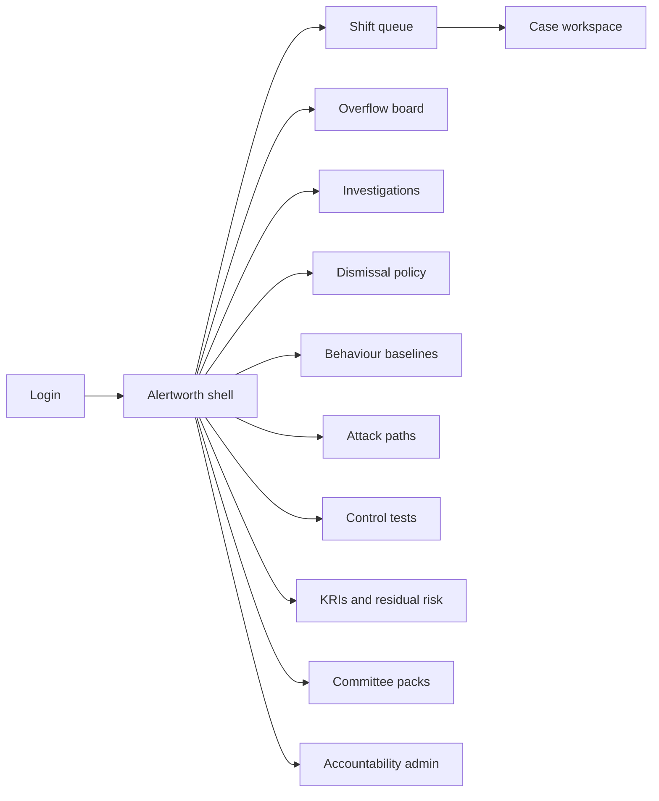
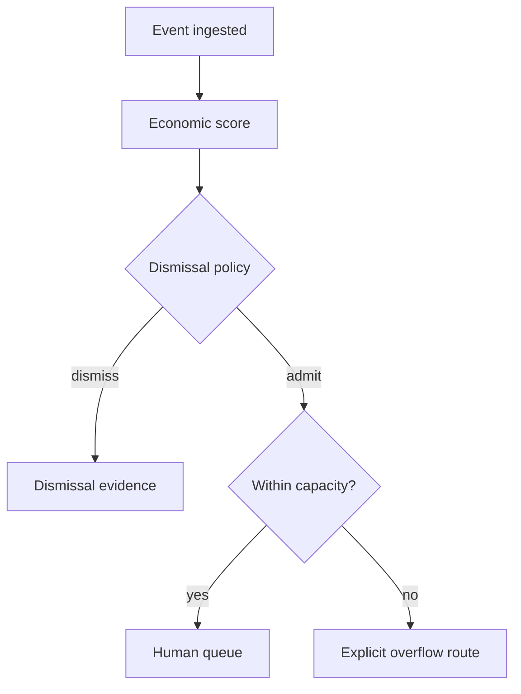

# Alertworth — Web app

**Product:** [PRODUCT.md](./PRODUCT.md)
**Primary surface:** Detection-economics SOC console (capacity-capped triage → investigation → residual-risk board pack)
**Secondary surfaces:** Dismissal-policy lab (back-test & publish); read-only audit-committee residual-risk pack
**Design thesis:** Alertworth is a factory floor for scarce analyst minutes — the UI metaphor is a shift capacity board where every alert carries a price tag (loss if ignored ÷ effort to work). Visual language is cold industrial steel with worth-amber for queue admission and mint for minutes returned; low-worth noise stays dimmed behind a published dismissal gate. Brand wordmark stamps the queue and every board KRI so the committee knows residual risk was priced here, not counted from ticket volume.

## UX research synthesis

### Category peers (best-in-class)

- **Microsoft Sentinel / Azure Monitor workbooks:** Incident queues with severity, tactics, and workbook KRIs for executives. Steal: incident→entity investigation layout; reject severity-only sorting as the home default.
- **Splunk SOAR / Phantom:** Playbook-driven triage with explicit automation vs human handoff. Steal: immutable action logs and override paths; reject automating containment without named accountability.
- **Palo Alto Cortex XSIAM / XSOAR:** Alert grouping and capacity-aware SOC workflows. Steal: queue hygiene and related-alert clustering; reject vendor severity as economic truth.
- **Exabeam / UEBA consoles:** Behavioural baselines with population scope for insider risk. Steal: baseline definition before case open; reject opaque “risk user” scores without lawful-basis chrome.

### Patterns to adopt / reject

- **Adopt:** Worth score on every human-queued alert; capacity-capped shift queue; explicit overflow; published dismissal policy with false-dismissal back-test; KRI freshness degradation; residual risk vs appetite; challenge-auto-dismiss; named shift lead required.
- **Reject:** Infinite backlog hero metrics; alert-volume board charts; silent drop on overload; black-box attack paths; purple AI triage mascots; replacing SIEM as a prerequisite.

### Trust, density, and workflow constraints from PRODUCT.md

Human queue admission is an economic decision (BR-1). Auto-dismiss needs published policy + back-test (BR-2). Capacity is hard-capped; overflow is explicit (BR-3). Board KRIs degrade when evidence is stale (BR-4, BR-5). Insider baselines need lawful basis before cases (BR-6). Continuous control tests feed the same residual view (BR-7). Attack paths must be explainable (BR-8). Containment is logged with override (BR-9). Time-returned proof within a quarter (BR-10). No shift without accountable lead (BR-11). SIEM/EDR stay (BR-12).

## Information architecture

### Nav model

### Roles → default home

| Role | Default home | Why |
|------|--------------|-----|
| SOC manager / shift lead | Shift queue + capacity | Cap and overflow (BR-3, BR-11) |
| Tier-1 / Tier-2 analyst | Queued alerts / cases | Worth-first work (BR-1) |
| Threat hunter | Attack paths | Explainable prioritisation (BR-8) |
| Cyber risk / GRC | KRIs and residual risk | Appetite reporting (BR-5) |
| CISO | Residual risk pack + minutes returned | Board artefact + ROI (BR-4, BR-10) |
| Privacy officer | Behaviour baselines | Lawful basis gate (BR-6) |
| Platform admin | Action logs / integrations | Containment governance (BR-9, BR-12) |

### Cross-links to OpenAPI resources

| Nav area | OpenAPI tags / resources |
|----------|---------------------------|
| Ingested events | Events |
| Economic scores | Scoring |
| Queue, overflow, dismissals | Triage |
| Cases / dispositions | Investigations |
| Insider / anomaly baselines | Baselines |
| Continuous control tests | Controls |
| KRIs | Indicators |
| Residual risk / packs / time-returned | Reporting |

## Screen inventory

### Shift queue (home)

- **Purpose:** Fill human triage to declared capacity by worth, not volume.
- **Entry:** Shift lead / analyst default after lead assigned.
- **Layout regions:** Capacity meter (slots filled / declared); worth-sorted alert table (loss-if-ignored, effort, attack type, frequency, prior disposition); legacy severity parallel-run column; overflow badge; minutes-returned sparkline.
- **Primary actions:** Claim alert; challenge auto-dismiss; route overflow; end shift.
- **Empty / loading / error:** Empty under capacity = healthy; no named lead = queue locked (BR-11).
- **BR / story ties:** BR-1, BR-3, BR-11; SOC manager stories.

### Overflow board

- **Purpose:** Explicit defer / auto-contain / MDR escalate when capacity breaches — never silent drop.
- **Entry:** Capacity breach; shift lead nav.
- **Layout regions:** Overflow candidates with worth; route options; MDR handoff status; audit note.
- **Primary actions:** Choose route; bulk by policy class; undo within window if policy allows.
- **Empty / loading / error:** Empty = “within capacity.”
- **BR / story ties:** BR-3; shift lead stories.

### Dismissal policy lab

- **Purpose:** Publish auto-dismiss classes with back-tested false-dismissal rates.
- **Entry:** Policy nav; CISO review.
- **Layout regions:** Policy versions; class rules; historical true-positive back-test; accuracy gates; owner.
- **Primary actions:** Simulate; publish; revoke class; export for incident after-action.
- **Empty / loading / error:** Below accuracy floor = cannot publish.
- **BR / story ties:** BR-2, BR-10.

### Investigation workspace

- **Purpose:** Targeted investigation with historical context and related entities; capture disposition for learning.
- **Entry:** Queue claim; hunter escalate.
- **Layout regions:** Alert worth header; entity graph; timeline; SIEM deep links; disposition + true/false; challenge history.
- **Primary actions:** Escalate; close with disposition; force-queue from dismissed class.
- **Empty / loading / error:** Telemetry link fail = show hash refs + retry to SIEM.
- **BR / story ties:** BR-1; Tier-1/2 stories.

### Behaviour baselines

- **Purpose:** Activate anomalous/insider detections only after population, purpose, lawful basis recorded.
- **Entry:** Baselines nav; privacy approval flow.
- **Layout regions:** Baseline definition; population scope; lawful-basis attestation; activation state; linked anomalies.
- **Primary actions:** Submit for privacy sign-off; activate; suspend.
- **Empty / loading / error:** Missing lawful basis = investigation case creation blocked from this baseline (BR-6).
- **BR / story ties:** BR-6; privacy officer stories.

### Attack path board

- **Purpose:** Explainable path ranking: asset criticality, likely path, recommended control/patch.
- **Entry:** Hunter home; from high-worth alert.
- **Layout regions:** Ranked paths; explanation pane; accept/reject; ticket to vuln/ITSM.
- **Primary actions:** Accept path; reject with reason; open case.
- **Empty / loading / error:** Insufficient asset criticality data = paths marked provisional.
- **BR / story ties:** BR-8.

### Control test schedule

- **Purpose:** Continuous/change-triggered tests feeding the same residual-risk view as the board.
- **Entry:** Controls nav; GRC home.
- **Layout regions:** Test calendar; results; failed controls linked to residual risk; freshness.
- **Primary actions:** Trigger test; assign remediation; publish result into KRI inputs.
- **Empty / loading / error:** Stale tests degrade related KRIs (BR-4, BR-7).
- **BR / story ties:** BR-7; GRC stories.

### KRI and residual risk

- **Purpose:** Residual cyber risk vs appetite; KRIs degrade when evidence stale/thin.
- **Entry:** Risk analyst / CISO home shortcut.
- **Layout regions:** Appetite thresholds; residual snapshot; KRI tiles with freshness badges; owners; volume charts demoted/hidden.
- **Primary actions:** Set thresholds; acknowledge breach; drill to evidence hashes.
- **Empty / loading / error:** Stale evidence = automatic degrade, not green.
- **BR / story ties:** BR-4, BR-5.

### Committee pack

- **Purpose:** Board artefact from live residual risk — not open-ticket counts.
- **Entry:** Reporting → Packs; CISO chief of staff.
- **Layout regions:** Residual vs appetite; minutes returned vs baseline; dismissal accuracy; evidence freshness summary; export.
- **Primary actions:** Publish pack; freeze snapshot; share read-only.
- **Empty / loading / error:** Parallel-run incomplete = watermark “baseline quarter in progress” (BR-10).
- **BR / story ties:** BR-4, BR-5, BR-10; CISO stories.

### Containment action log

- **Purpose:** Immutable log of automated containment with override path and policy version.
- **Entry:** Admin; incident reconstruction.
- **Layout regions:** Action timeline; actor/policy/override; EDR/identity command refs.
- **Primary actions:** Override; export for audit.
- **Empty / loading / error:** Integration down = queued actions with fail state visible.
- **BR / story ties:** BR-9.

### Accountability admin

- **Purpose:** Named owners for queue, dismissal policy, KRIs; refuse shift without lead.
- **Entry:** Admin.
- **Layout regions:** Role assignments; shift calendar; lock status.
- **Primary actions:** Assign lead; rotate; audit gaps.
- **Empty / loading / error:** Unassigned shift = hard lock on queue open.
- **BR / story ties:** BR-11.

## Key flows

1. **Economic triage** — event scored → dismissal policy → queue or dismiss → capacity check → overflow if full; failure: no shift lead locks queue.

2. **Challenge dismiss** — analyst forces dismissed class into queue → rationale logged → disposition feeds back-test (BR-2).

3. **Board KRI freshness** — control test / detection evidence ages out → KRI degrades → residual snapshot updates pack (BR-4).

4. **Baseline-gated insider case** — privacy attests lawful basis → baseline active → anomaly scored → may enter queue (BR-6).

5. **Parallel-run proof** — after one quarter, report minutes returned and TP rate vs pre-Alertworth baseline (BR-10).

## Design system

### Tokens (CSS variables)

- `--color-ink: #E7EEF5` — primary text
- `--color-ground: #0A1016` — industrial ground
- `--color-panel: #131A22` — panels
- `--color-rule: #2B3642` — dividers
- `--color-worth: #E09A3E` — queue-worthy amber
- `--color-worth-dim: #8A5A24` — below threshold
- `--color-minutes: #4FAE8C` — analyst minutes returned
- `--color-overflow: #D4564E` — capacity breach / overflow
- `--color-fresh: #6B8FBF` — evidence fresh
- `--color-stale: #A89B6A` — KRI degraded
- `--color-steel: #8A97A6` — secondary labels
- `--color-brand: #C9D2DA` — Alertworth wordmark
- `--font-display: "IBM Plex Sans", sans-serif` — capacity and worth numerals
- `--font-mono: "IBM Plex Mono", monospace` — alert ids, policy versions, hashes
- `--space-1`…`--space-8`: 4px scale
- `--radius-sm: 4px`; `--radius-md: 8px`
- `--motion-admit: 160ms ease-out` — alert enters queue
- `--motion-overflow: 280ms pulse` — capacity breach
- `--motion-degrade: 320ms ease-in-out` — KRI freshness fade
- Atmosphere: subtle factory-grid / shift-board texture; cool vignette; no purple AI glow; no rainbow severity fireworks.

### Typography & brand

- Display for worth and capacity; mono for alert ids, policy versions, action log.
- Brand on queue, residual risk, and committee pack; never “Dashboard” as strongest mark.
- Login: brand-first; headline (“Fill the queue to worth, not volume”); one CTA.

### Do / don’t

- **Do:** Show loss-if-ignored and effort; hard-cap capacity; explicit overflow; freshness badges on KRIs; parallel-run severity column during transition.
- **Don’t:** Infinite backlog pride metrics; volume-as-posture; silent drops; black-box paths; emoji severities; card grids of vanity AI scores.

### Accessibility & domain trust cues

- AA+ on worth/overflow/minutes; queue state in text (Queued / Dismissed / Overflow).
- Live regions for capacity breach and KRI degrade.
- Focus order: capacity → worth row → case → disposition.
- Lawful-basis and dismissal policy always reachable from related cases.

## Component patterns

- **WorthScoreChip** — expected loss vs effort with admit/dismiss threshold.
- **CapacityMeter** — shift slots declared vs filled.
- **OverflowRoutePicker** — defer / auto-contain / MDR.
- **DismissalBacktestPanel** — false-dismissal rate per class.
- **ParallelSeverityColumn** — legacy severity beside worth during parallel run.
- **FreshnessBadge** — KRI evidence age vs policy.
- **ResidualAppetiteGauge** — residual vs stated appetite (not volume).
- **BaselineLawfulGate** — population/purpose/basis before activate.
- **AttackPathExplain** — criticality + path + recommended action.
- **ContainmentActionRow** — immutable log with override.

## Out of scope for v1 web

- Replacing SIEM/EDR; autonomous MDR without human overflow decisions; full SOAR playbook IDE; consumer mobile SOC app; cross-tenant telemetry sharing; generative chatbot as primary triage UI.
